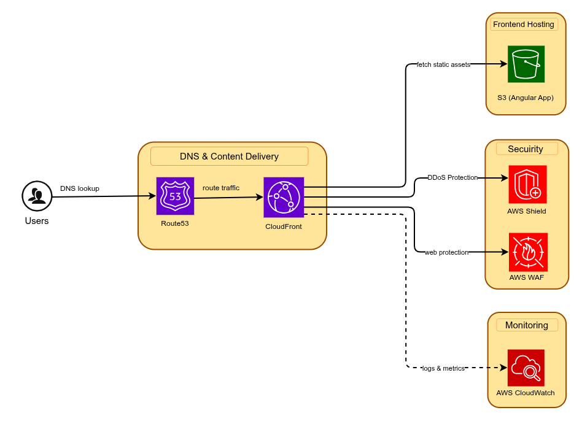
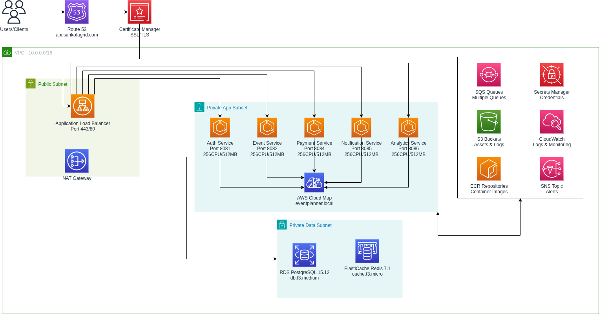
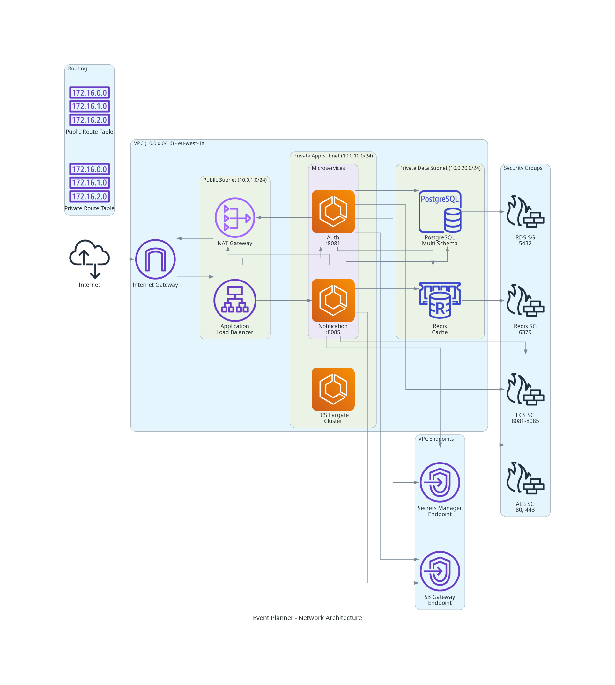

# Event Planner - Infrastructure as Code

## Centralized DevOps Infrastructure

This repository contains the complete Terraform infrastructure code for the Event Planner Platform, implementing a centralized DevOps approach with automated CI/CD pipelines.

## Table of Contents

1. [Architecture Overview](#architecture-overview)
2. [Active Services](#active-services)
3. [Repository Structure](#repository-structure)
4. [Prerequisites](#prerequisites)
5. [Quick Start](#quick-start)
6. [CI/CD Pipeline](#cicd-pipeline)
7. [Infrastructure Modules](#infrastructure-modules)
8. [Secrets Management](#secrets-management)
9. [Cost Optimization](#cost-optimization)

## Architecture Overview

### Frontend Architecture



### Backend Architecture



### Network Architecture



### Infrastructure Components

**Frontend:**
- S3 bucket for Angular application hosting
- CloudFront distribution (events.sankofagrid.com)
- ACM SSL/TLS certificates

**Backend:**
- VPC with public/private subnets (single-AZ dev, multi-AZ prod)
- ECS Fargate cluster for microservices
- Application Load Balancer with HTTPS (api.sankofagrid.com)
- AWS Cloud Map service discovery (eventplanner.local)
- RDS PostgreSQL with multi-schema approach
- ElastiCache Redis for caching
- SNS/SQS for event-driven messaging

**Network:**
- Development: Single-AZ (eu-west-1a) for cost optimization
- Production: Multi-AZ (2 AZs) for high availability
- NAT Gateway for external connectivity
- VPC endpoints for AWS services

## Active Services

**Currently Running:**
- **Auth Service**: Port 8081 - User authentication and management
- **Event Service**: Port 8082 - Event creation and management
- **Payment Service**: Port 8088 - Payment processing (Paystack integration)
- **Notification Service**: Port 8085 - Email and SMS notifications

**Service Discovery:**
- auth-service.eventplanner.local:8081
- event-service.eventplanner.local:8082
- payment-service.eventplanner.local:8088
- notification-service.eventplanner.local:8085

**Database Schemas:**
- auth_schema - User authentication
- event_schema - Event management
- payment_schema - Payment transactions
- Shared PostgreSQL instance with multi-schema design

**Message Queues (SQS/SNS):**
- User registration/login queues
- Event creation/invitation queues
- Payment processing/status queues
- Notification queues
- Withdrawal notification queue
- Webhook event queue

## Repository Structure

```
get-devops/
├── .github/
│   ├── workflows/
│   │   └── infrastructure-ci-cd.yml    # Main CI/CD pipeline
│   └── actions/                        # Reusable GitHub Actions
├── terraform/
│   ├── modules/
│   │   ├── vpc/                        # Network infrastructure
│   │   ├── security-groups/            # Security rules
│   │   ├── iam/                        # IAM roles and policies
│   │   ├── rds/                        # PostgreSQL database
│   │   ├── elasticache/                # Redis cache
│   │   ├── ecs/                        # ECS Fargate cluster
│   │   ├── alb/                        # Application Load Balancer
│   │   ├── s3/                         # S3 buckets
│   │   ├── cloudfront/                 # CDN distribution
│   │   ├── acm/                        # SSL certificates
│   │   ├── secrets-manager/            # Secrets management
│   │   ├── sqs-sns/                    # Message queuing
│   │   ├── ecr/                        # Container registry
│   │   └── cloudwatch/                 # Monitoring and logging
│   └── environments/
│       ├── dev/                        # Development environment
│       └── prod/                       # Production environment
└── docs/                               # Documentation and diagrams
```

## Prerequisites

**Required Tools:**
- Terraform >= 1.5.0
- AWS CLI >= 2.0
- GitHub account with Actions enabled

**AWS Permissions:**
- VPC, EC2, ECS, ALB
- RDS, ElastiCache
- S3, CloudFront, ACM
- Secrets Manager, ECR
- SQS, SNS
- IAM, CloudWatch

**Domain:**
- sankofagrid.com (external DNS)
- events.sankofagrid.com → CloudFront
- api.sankofagrid.com → ALB

## Quick Start

### 1. Configure AWS Credentials

```bash
aws configure
# Enter AWS Access Key ID
# Enter AWS Secret Access Key
# Default region: eu-west-1
```

### 2. Set GitHub Secrets

Configure in GitHub repository settings → Secrets and variables → Actions:

```
AWS_ACCESS_KEY_ID
AWS_SECRET_ACCESS_KEY
AWS_REGION
TF_STATE_BUCKET
TF_STATE_DYNAMODB_TABLE
PAYMENT_SERVICE_URL
SLACK_WEBHOOK_URL (optional)
```

### 3. Deploy Infrastructure

```bash
# Push to main branch triggers deployment
git push origin main

# Or manually trigger via GitHub Actions
# Go to Actions → Infrastructure CI/CD Pipeline → Run workflow
```

### 4. Verify Deployment

```bash
# Check ECS services
aws ecs list-services --cluster event-planner-dev-cluster

# Check ALB health
curl https://api.sankofagrid.com/actuator/health

# View CloudWatch logs
aws logs tail /ecs/event-planner/dev/payment-service --follow
```

## CI/CD Pipeline

### CI/CD Architecture


### Pipeline Stages

The infrastructure deployment follows this sequence:

1. **Validate** - Terraform format check, syntax validation, TFLint
2. **Security Scan** - Terraform security scanning (Checkov/tfsec)
3. **Plan** - Generate and review infrastructure changes
4. **Deploy** - Apply infrastructure changes (main branch only)
5. **Notify** - Send deployment status to Slack

### Workflow Triggers

- **Push to main/dev/staging** - Automatic deployment
- **Pull Request** - Plan only (no deployment)
- **Manual Trigger** - Via GitHub Actions UI

### Environment Protection

- **Development** - No approval required
- **Staging** - Optional approval
- **Production** - Required approval from designated reviewers

## Infrastructure Modules

### VPC Module
- Creates VPC with public/private subnets
- NAT Gateway for external connectivity
- VPC endpoints for AWS services

### ECS Module
- Fargate cluster with 4 active services
- Auto-scaling based on CPU/memory
- Service discovery via AWS Cloud Map
- Environment variables for all services

### RDS Module
- Single PostgreSQL instance with multi-schema
- Schemas: auth_schema, event_schema, payment_schema
- Automated backups (3-day retention dev, 7-day prod)
- Encryption at rest and in transit

### SQS/SNS Module
- Event-driven messaging architecture
- SNS topics: event, payment
- SQS queues with dead letter queues
- Message filtering by event type

### ALB Module
- HTTPS listener with ACM certificate
- Path-based routing to services
- Health checks for all services
- Access logs to S3

### Security Groups Module
- ALB: HTTPS from internet
- ECS: Service ports from ALB
- RDS: PostgreSQL from ECS
- ElastiCache: Redis from ECS

### IAM Module
- ECS task execution role
- Service-specific task roles
- SNS/SQS permissions for messaging
- Secrets Manager access

## Secrets Management

### Required Secrets (AWS Secrets Manager)

Create these secrets before deployment:

```bash
# JWT Secret
aws secretsmanager create-secret \
  --name event-planner/dev/jwt-secret \
  --secret-string '{"JWT_SECRET":"your-secret-key"}'

# Google Credentials (for notification service)
aws secretsmanager create-secret \
  --name event-planner/dev/google-credentials \
  --secret-string '{"GOOGLE_USER":"email","GOOGLE_PASSWORD":"password"}'

# Paystack Credentials (for payment service)
aws secretsmanager create-secret \
  --name event-planner/dev/paystack-credentials \
  --secret-string '{"PAYSTACK_SECRET":"your-paystack-key"}'

# Redis Auth Token
aws secretsmanager create-secret \
  --name event-planner/dev/redis-credentials \
  --secret-string '{"REDIS_AUTH_TOKEN":"your-redis-token"}'
```

### Secrets Access

ECS tasks automatically retrieve secrets at runtime via IAM roles. No manual configuration needed in application code.

## Cost Optimization

### Development Environment

**Current Monthly Cost: ~$150-200**

- Single-AZ deployment
- Minimal instance sizes (t3.micro/t4g.micro)
- No read replicas
- Single NAT Gateway
- VPC endpoints for AWS services

**Cost Breakdown:**
- ECS Fargate: ~$50-70
- RDS PostgreSQL: ~$30-40
- ElastiCache Redis: ~$15-20
- NAT Gateway: ~$30-35
- ALB: ~$20-25
- Other services: ~$10-15

### Production Environment

**Estimated Monthly Cost: ~$800-1200**

- Multi-AZ deployment (2 AZs)
- Larger instance sizes
- RDS read replicas
- Multiple NAT Gateways
- Auto-scaling enabled

### Cost Saving Tips

1. Stop dev environment during off-hours
2. Use Fargate Spot for non-critical workloads (prod)
3. Enable S3 lifecycle policies for logs
4. Use Reserved Instances for RDS (prod)
5. Optimize CloudFront cache hit ratio

## Monitoring and Logging

### CloudWatch Dashboards

- ECS service metrics (CPU, memory, task count)
- ALB metrics (request count, latency, errors)
- RDS metrics (connections, CPU, storage)
- ElastiCache metrics (CPU, memory, evictions)

### Log Groups

- `/ecs/event-planner/dev/auth-service`
- `/ecs/event-planner/dev/event-service`
- `/ecs/event-planner/dev/payment-service`
- `/ecs/event-planner/dev/notification-service`

### Alarms

- ECS high CPU/memory usage
- ALB 5xx errors
- RDS connection count
- SQS dead letter queue messages

## Troubleshooting

### ECS Service Not Starting

```bash
# Check service events
aws ecs describe-services \
  --cluster event-planner-dev-cluster \
  --services payment-service

# View task logs
aws logs tail /ecs/event-planner/dev/payment-service --follow
```

### Database Connection Issues

```bash
# Verify security group rules
aws ec2 describe-security-groups --group-ids <RDS_SG_ID>

# Test connectivity from ECS task
aws ecs execute-command \
  --cluster event-planner-dev-cluster \
  --task <TASK_ID> \
  --command "nc -zv <RDS_ENDPOINT> 5432"
```

### Deployment Failures

```bash
# Check GitHub Actions logs
# Go to Actions → Failed workflow → View logs

# Force unlock Terraform state (if locked)
terraform force-unlock <LOCK_ID>
```

## Additional Resources

- [Centralized DevOps Structure](docs/centralized-devops-structure.md)
- [AWS Well-Architected Framework](https://aws.amazon.com/architecture/well-architected/)
- [Terraform Best Practices](https://www.terraform.io/docs/cloud/guides/recommended-practices/)
- [ECS Best Practices](https://docs.aws.amazon.com/AmazonECS/latest/bestpracticesguide/)

---

**Last Updated:** November 2025  
**Maintained By:** DevOps Team  
**Version:** 2.0.0
