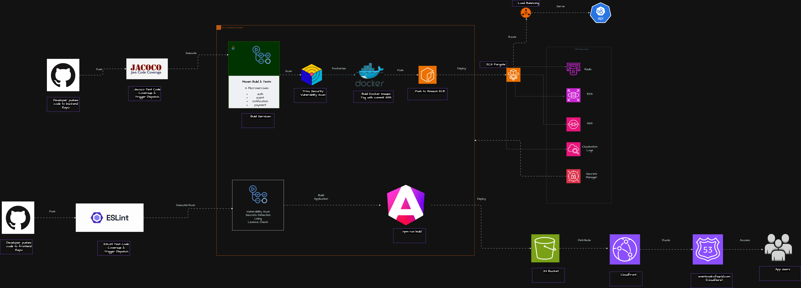

# Event Planner - Infrastructure as Code

## Centralized DevOps Infrastructure

Complete Terraform infrastructure for the Event Planner Platform with automated CI/CD pipelines, monitoring, and security.

## Table of Contents

1. [Architecture Overview](#architecture-overview)
2. [Active Services](#active-services)
3. [Project Structure](#project-structure)
4. [Prerequisites](#prerequisites)
5. [Quick Start](#quick-start)
6. [CI/CD Pipelines](#cicd-pipelines)
7. [Infrastructure Modules](#infrastructure-modules)
8. [Monitoring & Logging](#monitoring--logging)
9. [Secrets Management](#secrets-management)
10. [Cost Optimization](#cost-optimization)
11. [Documentation](#documentation)

## Architecture Overview

### Frontend Architecture


### Backend Architecture


### Network Architecture


### Infrastructure Components

**Frontend:**
- S3 bucket for Angular application hosting
- CloudFront distribution (events.sankofagrid.com)
- ACM SSL/TLS certificates
- External DNS managed by Cloudflare

**Backend:**
- VPC with public/private subnets (single-AZ dev, multi-AZ prod)
- ECS Fargate cluster for microservices
- Application Load Balancer with HTTPS (api.sankofagrid.com)
- AWS Cloud Map service discovery (eventplanner.local)
- RDS PostgreSQL with multi-schema approach
- ElastiCache Redis for caching
- SNS/SQS for event-driven messaging

**Network:**
- Development: Single-AZ (eu-west-1a) for cost optimization
- Production: Multi-AZ (2 AZs) for high availability
- NAT Gateway for external connectivity
- VPC endpoints for AWS services

## Active Services

**Currently Running:**
- **Auth Service**: Port 8081 - User authentication and management
- **Event Service**: Port 8082 - Event creation and management
- **Payment Service**: Port 8088 - Payment processing (Paystack integration)
- **Notification Service**: Port 8085 - Email and SMS notifications

**Service Discovery:**
- auth-service.eventplanner.local:8081
- event-service.eventplanner.local:8082
- payment-service.eventplanner.local:8088
- notification-service.eventplanner.local:8085

**Database Schemas:**
- auth_schema - User authentication
- event_schema - Event management
- payment_schema - Payment transactions
- Shared PostgreSQL instance with multi-schema design

**Message Queues (SQS/SNS):**
- User registration/login queues
- Event creation/invitation queues
- Payment processing/status queues
- Notification queues
- Withdrawal notification queue
- Webhook event queue

## Project Structure

```
get-devops/
├── .github/
│   ├── workflows/
│   │   ├── infrastructure-ci-cd.yml       # Infrastructure deployment pipeline
│   │   ├── backend-ci-cd.yml              # Backend services deployment
│   │   ├── frontend-ci-cd.yml             # Frontend deployment
│   │   ├── backend-prod-blue-green.yml    # Production blue-green deployment
│   │   ├── frontend-prod-blue-green.yml   # Frontend blue-green deployment
│   │   └── master-pipeline.yml            # Orchestrates all pipelines
│   └── actions/                           # Reusable GitHub Actions
│       ├── aws-configure/                 # AWS credentials setup
│       ├── terraform-init/                # Terraform initialization
│       ├── terraform-deploy/              # Terraform deployment
│       ├── terraform-security-scan/       # Security scanning
│       ├── docker-build-push/             # Docker image build & push
│       ├── ecs-deploy/                    # ECS service deployment
│       ├── frontend-build/                # Angular build
│       ├── s3-deploy/                     # S3 deployment
│       └── setup-*/                       # Tool setup actions
├── terraform/
│   ├── modules/
│   │   ├── vpc/                           # Network infrastructure
│   │   ├── security-groups/               # Security rules
│   │   ├── iam/                           # IAM roles and policies
│   │   ├── rds/                           # PostgreSQL database
│   │   ├── elasticache/                   # Redis cache
│   │   ├── ecs/                           # ECS Fargate cluster
│   │   ├── alb/                           # Application Load Balancer
│   │   ├── s3/                            # S3 buckets
│   │   ├── cloudfront/                    # CDN distribution
│   │   ├── acm/                           # SSL certificates
│   │   ├── secrets-manager/               # Secrets management
│   │   ├── sqs-sns/                       # Message queuing
│   │   ├── ecr/                           # Container registry
│   │   ├── cloudwatch/                    # Monitoring and logging
│   │   ├── cloudwatch-dashboards/         # Service-specific dashboards
│   │   └── waf/                           # Web Application Firewall
│   └── environments/
│       ├── dev/                           # Development environment
│       │   ├── main.tf
│       │   ├── variables.tf
│       │   ├── terraform.tfvars
│       │   └── backend.tf
│       └── prod/                          # Production environment
│           ├── main.tf
│           ├── variables.tf
│           ├── terraform.tfvars
│           └── backend.tf
├── docs/
│   ├── architecture/                      # Architecture documentation
│   │   ├── AWS_INFRASTRUCTURE_ARCHITECTURE-DEV.md
│   │   └── AWS_INFRASTRUCTURE_ARCHITECTURE-PROD.md
│   ├── diagrams/                          # Architecture diagrams
│   │   ├── frontend-architecture.png
│   │   ├── backend-architecture.png
│   │   ├── network-architecture.png
│   │   ├── ci-cd-architecture-draft.png
│   │   ├── grafana-architecture.png
│   │   └── security-architecture.png
│   ├── 01-project-overview.md             # Project overview
│   ├── 02-terraform-infrastructure.md     # Infrastructure details
│   ├── 03-cicd-pipeline-implementation.md # CI/CD implementation
│   ├── 04-deployment-workflows.md         # Deployment procedures
│   ├── 05-monitoring-security-operations-I.md  # Monitoring setup
│   ├── 05-monitoring-security-operations-II.md # Security operations
│   ├── 06-cost-optimization-best-practices.md  # Cost optimization
│   ├── 07-troubleshooting-runbooks.md     # Troubleshooting guides
│   ├── centralized-devops-structure.md    # DevOps structure
│   ├── GRAFANA-MONITORING-PLAN.md         # Grafana setup
│   ├── GRAFANA-DEPLOYMENT-SUMMARY.md      # Grafana deployment
│   └── GEP-Grafana-Monitor-Usage-Guide.md # Grafana usage guide
└── README.md                              # This file
```

## Prerequisites

**Required Tools:**
- Terraform >= 1.5.0
- AWS CLI >= 2.0
- GitHub account with Actions enabled

**AWS Permissions:**
- VPC, EC2, ECS, ALB
- RDS, ElastiCache
- S3, CloudFront, ACM
- Secrets Manager, ECR
- SQS, SNS
- IAM, CloudWatch

**Domain Configuration:**
- Domain: sankofagrid.com
- DNS Provider: Cloudflare
- Frontend: events.sankofagrid.com → CloudFront
- Backend API: api.sankofagrid.com → ALB

## Quick Start

### 1. Configure AWS Credentials

```bash
aws configure
# Enter AWS Access Key ID
# Enter AWS Secret Access Key
# Default region: eu-west-1
```

### 2. Set GitHub Secrets

Configure in GitHub repository settings → Secrets and variables → Actions:

```
AWS_ACCESS_KEY_ID
AWS_SECRET_ACCESS_KEY
AWS_REGION
TF_STATE_BUCKET
TF_STATE_DYNAMODB_TABLE
PAYMENT_SERVICE_URL
SLACK_WEBHOOK_URL (optional)
```

### 3. Deploy Infrastructure

```bash
# Push to main branch triggers deployment
git push origin main

# Or manually trigger via GitHub Actions
# Go to Actions → Infrastructure CI/CD Pipeline → Run workflow
```

### 4. Verify Deployment

```bash
# Check ECS services
aws ecs list-services --cluster event-planner-dev-cluster

# Check ALB health
curl https://api.sankofagrid.com/actuator/health

# View CloudWatch logs
aws logs tail /ecs/event-planner/dev/payment-service --follow
```

## CI/CD Pipelines

### CI/CD Architecture



### Pipeline Overview

**Infrastructure Pipeline** (`infrastructure-ci-cd.yml`)
- Validates Terraform code
- Runs security scans
- Plans infrastructure changes
- Deploys to AWS
- Sends notifications

**Backend Pipeline** (`backend-ci-cd.yml`)
- Builds Java/Spring Boot services
- Runs unit tests
- Builds Docker images
- Pushes to ECR
- Deploys to ECS Fargate

**Frontend Pipeline** (`frontend-ci-cd.yml`)
- Builds Angular application
- Runs tests and linting
- Deploys to S3
- Invalidates CloudFront cache

**Master Pipeline** (`master-pipeline.yml`)
- Orchestrates all pipelines
- Manages deployment order
- Handles cross-pipeline dependencies

### Pipeline Stages

**Infrastructure Deployment:**
1. **Validate** - Terraform format check, syntax validation, TFLint
2. **Security Scan** - Terraform security scanning (Checkov/tfsec)
3. **Plan** - Generate and review infrastructure changes
4. **Deploy** - Apply infrastructure changes (main branch only)
5. **Notify** - Send deployment status to Slack

**Backend Deployment:**
1. **Build** - Maven build and test
2. **Docker** - Build and push images to ECR
3. **Deploy** - Update ECS services
4. **Verify** - Health check validation

**Frontend Deployment:**
1. **Build** - Angular production build
2. **Deploy** - Upload to S3
3. **Invalidate** - CloudFront cache invalidation

### Workflow Triggers

- **Push to main/dev/staging** - Automatic deployment
- **Pull Request** - Plan only (no deployment)
- **Manual Trigger** - Via GitHub Actions UI

### Environment Protection

- **Development** - No approval required
- **Staging** - Optional approval
- **Production** - Required approval from designated reviewers

## Infrastructure Modules

### VPC Module
- VPC with public/private subnets
- NAT Gateway for external connectivity
- VPC endpoints for AWS services

### ECS Module
- Fargate cluster with 4 active services
- Auto-scaling based on CPU/memory
- Service discovery via AWS Cloud Map
- Environment variables for all services

### RDS Module
- Single PostgreSQL instance with multi-schema
- Schemas: auth_schema, event_schema, payment_schema
- Automated backups (3-day retention dev, 7-day prod)
- Encryption at rest and in transit

### SQS/SNS Module
- Event-driven messaging architecture
- SNS topics: event, payment
- SQS queues with dead letter queues
- Message filtering by event type

### ALB Module
- HTTPS listener with ACM certificate
- Path-based routing to services
- Health checks for all services
- Access logs to S3

### Security Groups Module
- ALB: HTTPS from internet
- ECS: Service ports from ALB
- RDS: PostgreSQL from ECS
- ElastiCache: Redis from ECS

### IAM Module
- ECS task execution role
- Service-specific task roles
- SNS/SQS permissions for messaging
- Secrets Manager access

## Monitoring & Logging

### CloudWatch Dashboards

**Service-Specific Dashboards:**
- Auth Service Dashboard - Authentication metrics
- Event Service Dashboard - Event management metrics
- Payment Service Dashboard - Payment transaction metrics
- Notification Service Dashboard - Email/SMS delivery metrics

**Infrastructure Dashboards:**
- ECS service metrics (CPU, memory, task count)
- ALB metrics (request count, latency, errors)
- RDS metrics (connections, CPU, storage)
- ElastiCache metrics (CPU, memory, evictions)

### Grafana Monitoring

**Grafana Dashboard** (Accessible at: `https://api.sankofagrid.com/monitoring/`)

**Data Sources:**
- CloudWatch - Infrastructure and application metrics
- PostgreSQL - Database queries and audit logs
- Audit Logs - JSONB-based audit trail

**Dashboard Categories:**
1. **Executive Dashboard** - Business metrics and KPIs
2. **Infrastructure Dashboard** - System health and performance
3. **Performance Dashboard** - API latency and response times
4. **Security Dashboard** - Authentication failures and security events

**Features:**
- Real-time monitoring and alerting
- Log aggregation from CloudWatch
- Database query performance analysis
- Audit log visualization
- Custom alerts and notifications

### Log Groups

- `/ecs/event-planner/dev/auth-service`
- `/ecs/event-planner/dev/event-service`
- `/ecs/event-planner/dev/payment-service`
- `/ecs/event-planner/dev/notification-service`

### Alarms

- ECS high CPU/memory usage
- ALB 5xx errors
- RDS connection count
- SQS dead letter queue messages
- Custom application-specific alerts

## Secrets Management

### Required Secrets (AWS Secrets Manager)

Create these secrets before deployment:

```bash
# JWT Secret
aws secretsmanager create-secret \
  --name event-planner/dev/jwt-secret \
  --secret-string '{"JWT_SECRET":"your-secret-key"}'

# Google Credentials (for notification service)
aws secretsmanager create-secret \
  --name event-planner/dev/google-credentials \
  --secret-string '{"GOOGLE_USER":"email","GOOGLE_PASSWORD":"password"}'

# Paystack Credentials (for payment service)
aws secretsmanager create-secret \
  --name event-planner/dev/paystack-credentials \
  --secret-string '{"PAYSTACK_SECRET":"your-paystack-key"}'

# Redis Auth Token
aws secretsmanager create-secret \
  --name event-planner/dev/redis-credentials \
  --secret-string '{"REDIS_AUTH_TOKEN":"your-redis-token"}'
```

### Secrets Access

ECS tasks automatically retrieve secrets at runtime via IAM roles. No manual configuration needed in application code.

## Cost Optimization

### Development Environment

**Current Monthly Cost: ~$150-200**

- Single-AZ deployment
- Minimal instance sizes (t3.micro/t4g.micro)
- No read replicas
- Single NAT Gateway
- VPC endpoints for AWS services

**Cost Breakdown:**
- ECS Fargate: ~$50-70
- RDS PostgreSQL: ~$30-40
- ElastiCache Redis: ~$15-20
- NAT Gateway: ~$30-35
- ALB: ~$20-25
- Other services: ~$10-15

### Production Environment

**Estimated Monthly Cost: ~$800-1200**

- Multi-AZ deployment (2 AZs)
- Larger instance sizes
- RDS read replicas
- Multiple NAT Gateways
- Auto-scaling enabled

### Cost Saving Tips

1. Stop dev environment during off-hours
2. Use Fargate Spot for non-critical workloads (prod)
3. Enable S3 lifecycle policies for logs
4. Use Reserved Instances for RDS (prod)
5. Optimize CloudFront cache hit ratio

## Documentation

### Project Documentation

- **[Project Overview](docs/01-project-overview.md)** - Complete project overview and objectives
- **[Terraform Infrastructure](docs/02-terraform-infrastructure.md)** - Detailed infrastructure documentation
- **[CI/CD Pipeline Implementation](docs/03-cicd-pipeline-implementation.md)** - CI/CD setup and configuration
- **[Deployment Workflows](docs/04-deployment-workflows.md)** - Step-by-step deployment procedures
- **[Monitoring & Security Operations I](docs/05-monitoring-security-operations-I.md)** - Monitoring setup and configuration
- **[Monitoring & Security Operations II](docs/05-monitoring-security-operations-II.md)** - Security operations and best practices
- **[Cost Optimization Best Practices](docs/06-cost-optimization-best-practices.md)** - Cost optimization strategies
- **[Troubleshooting Runbooks](docs/07-troubleshooting-runbooks.md)** - Common issues and solutions

### Architecture Documentation

- **[Development Architecture](docs/architecture/AWS_INFRASTRUCTURE_ARCHITECTURE-DEV.md)** - Development environment architecture
- **[Production Architecture](docs/architecture/AWS_INFRASTRUCTURE_ARCHITECTURE-PROD.md)** - Production environment architecture
- **[Centralized DevOps Structure](docs/centralized-devops-structure.md)** - DevOps organization and structure

### Monitoring Documentation

- **[Grafana Monitoring Plan](docs/GRAFANA-MONITORING-PLAN.md)** - Grafana setup and configuration
- **[Grafana Deployment Summary](docs/GRAFANA-DEPLOYMENT-SUMMARY.md)** - Grafana deployment details
- **[Grafana Usage Guide](docs/GEP-Grafana-Monitor-Usage-Guide.md)** - How to use Grafana dashboards

### External Resources

- [AWS Well-Architected Framework](https://aws.amazon.com/architecture/well-architected/)
- [Terraform Best Practices](https://www.terraform.io/docs/cloud/guides/recommended-practices/)
- [ECS Best Practices](https://docs.aws.amazon.com/AmazonECS/latest/bestpracticesguide/)

---

**Last Updated:** November 2025  
**Maintained By:** DevOps Team  
**Version:** 2.0.0
