# CI/CD Pipeline Flow - Detailed Execution Diagram

## Overview
This diagram shows the detailed execution flow of the CI/CD pipeline, including decision points, environment progression, approval gates, and failure handling.

## Sequence Diagrams - Component Interactions

### 1. Complete CI/CD Pipeline Sequence

```mermaid
sequenceDiagram
    participant Dev as 👨‍💻 Developer
    participant GH as 📱 GitHub
    participant Actions as ⚡ GitHub Actions
    participant ECR as 📦 AWS ECR
    participant ECS as 🐳 AWS ECS
    participant S3 as 🗂️ AWS S3
    participant CF as 🌐 CloudFront
    participant Slack as 💬 Slack
    participant Approver as 👥 Approvers

    Dev->>GH: Push code to branch
    GH->>Actions: Webhook trigger
    
    Actions->>Actions: Code validation & linting
    Actions->>Actions: Run unit tests
    Actions->>Actions: Security scanning
    
    alt Tests Pass
        Actions->>Actions: Build backend services
        Actions->>Actions: Build frontend assets
        Actions->>ECR: Push Docker images
        Actions->>S3: Upload build artifacts
        
        alt Development Branch
            Actions->>ECS: Deploy to dev environment
            ECS->>Actions: Health check response
            Actions->>Slack: Success notification
        else Staging Branch
            Actions->>Approver: Request approval (2 reviewers)
            Approver->>Actions: Approval granted
            Actions->>ECS: Deploy to staging
            Actions->>S3: Deploy frontend to staging
            Actions->>CF: Invalidate cache
            ECS->>Actions: Health check response
            Actions->>Actions: Run integration tests
            Actions->>Actions: Performance testing
            Actions->>Slack: Staging deployment success
        else Production Branch
            Actions->>Approver: Request approval (3 reviewers)
            Approver->>Actions: Approval granted
            Actions->>ECS: Deploy to blue environment
            Actions->>S3: Deploy to production S3
            ECS->>Actions: Blue environment health check
            Actions->>Actions: Run smoke tests
            alt Health Check Pass
                Actions->>ECS: Switch traffic (blue→green)
                Actions->>ECS: Cleanup old environment
                Actions->>CF: Invalidate production cache
                Actions->>Slack: Production deployment success
            else Health Check Fail
                Actions->>ECS: Rollback to previous version
                Actions->>Slack: Deployment failure alert
            end
        end
    else Tests Fail
        Actions->>Slack: Test failure notification
        Actions->>Dev: Failure details
    end
```

### 2. Backend Microservices Deployment Sequence

```mermaid
sequenceDiagram
    participant Dev as 👨‍💻 Developer
    participant GH as 📱 GitHub
    participant Actions as ⚡ GitHub Actions
    participant ECR as 📦 ECR Registry
    participant ECS as 🐳 ECS Cluster
    participant ALB as ⚖️ Load Balancer
    participant RDS as 🗄️ Database
    participant Slack as 💬 Slack

    Dev->>GH: Push backend code
    GH->>Actions: Trigger backend pipeline
    
    par Build All Services
        Actions->>Actions: Build user-service
        Actions->>Actions: Build event-service
        Actions->>Actions: Build notification-service
        Actions->>Actions: Build gateway-service
    end
    
    par Security Scans
        Actions->>Actions: Trivy scan user-service
        Actions->>Actions: Trivy scan event-service
        Actions->>Actions: Trivy scan notification-service
        Actions->>Actions: Trivy scan gateway-service
    end
    
    par Push Images
        Actions->>ECR: Push user-service:tag
        Actions->>ECR: Push event-service:tag
        Actions->>ECR: Push notification-service:tag
        Actions->>ECR: Push gateway-service:tag
    end
    
    Actions->>ECS: Update task definitions
    
    par Deploy Services
        ECS->>ECS: Rolling update user-service
        ECS->>ECS: Rolling update event-service
        ECS->>ECS: Rolling update notification-service
        ECS->>ECS: Rolling update gateway-service
    end
    
    ECS->>ALB: Register new tasks
    ALB->>ECS: Health check new tasks
    ECS->>RDS: Database connectivity check
    RDS->>ECS: Connection confirmed
    
    alt All Services Healthy
        ECS->>ALB: Remove old tasks
        Actions->>Slack: ✅ Backend deployment success
    else Service Unhealthy
        ECS->>ECS: Rollback failed service
        Actions->>Slack: ❌ Deployment failure
    end
```

### 3. Frontend Deployment with CDN Sequence

```mermaid
sequenceDiagram
    participant Dev as 👨‍💻 Developer
    participant GH as 📱 GitHub
    participant Actions as ⚡ GitHub Actions
    participant S3 as 🗂️ S3 Bucket
    participant CF as 🌐 CloudFront
    participant Route53 as 🌍 Route53
    participant Lighthouse as 🔍 Lighthouse
    participant Slack as 💬 Slack

    Dev->>GH: Push frontend code
    GH->>Actions: Trigger frontend pipeline
    
    Actions->>Actions: npm install & build
    Actions->>Actions: Run unit tests
    Actions->>Actions: Run e2e tests
    Actions->>Actions: Security audit (npm audit + Snyk)
    
    alt Tests Pass
        Actions->>Actions: Build for environment
        Actions->>S3: Sync build files
        S3->>Actions: Upload confirmation
        Actions->>CF: Create invalidation
        CF->>CF: Clear cache globally
        CF->>Actions: Invalidation complete
        
        alt Staging/Production
            Actions->>Lighthouse: Run performance audit
            Lighthouse->>Actions: Performance scores
            
            alt Performance Score >= 80
                Actions->>Slack: ✅ Frontend deployed successfully
                Actions->>Slack: 📊 Performance metrics
            else Performance Score < 80
                Actions->>Slack: ⚠️ Performance below threshold
            end
        else Development
            Actions->>Slack: ✅ Dev frontend deployed
        end
    else Tests Fail
        Actions->>Slack: ❌ Frontend tests failed
        Actions->>Dev: Test failure details
    end
```

### 4. Infrastructure Pipeline Sequence

```mermaid
sequenceDiagram
    participant Dev as 👨‍💻 DevOps Engineer
    participant GH as 📱 GitHub
    participant Actions as ⚡ GitHub Actions
    participant TF as 🏗️ Terraform
    participant AWS as ☁️ AWS Services
    participant Checkov as 🔒 Checkov
    participant Approver as 👥 Approvers
    participant Slack as 💬 Slack

    Dev->>GH: Push infrastructure changes
    GH->>Actions: Trigger infrastructure pipeline
    
    Actions->>TF: terraform fmt -check
    Actions->>TF: terraform validate
    Actions->>Actions: Run TFLint
    Actions->>Checkov: Security compliance scan
    
    alt Validation Pass
        alt Pull Request
            Actions->>TF: terraform plan
            TF->>AWS: Query current state
            AWS->>TF: Current infrastructure state
            TF->>Actions: Plan output
            Actions->>GH: Comment plan on PR
        else Push to Environment Branch
            alt Development
                Actions->>TF: terraform apply (auto-approve)
                TF->>AWS: Apply infrastructure changes
                AWS->>TF: Apply confirmation
                Actions->>Slack: ✅ Dev infrastructure updated
            else Staging
                Actions->>Approver: Request approval (2 reviewers)
                Approver->>Actions: Approval granted
                Actions->>TF: terraform apply
                TF->>AWS: Apply infrastructure changes
                AWS->>TF: Apply confirmation
                Actions->>Actions: Backup terraform state
                Actions->>Slack: ✅ Staging infrastructure updated
            else Production
                Actions->>Approver: Request approval (3 reviewers)
                Approver->>Actions: Approval granted
                Actions->>TF: terraform apply
                TF->>AWS: Apply infrastructure changes
                AWS->>TF: Apply confirmation
                Actions->>AWS: Post-deployment validation
                AWS->>Actions: Infrastructure health confirmed
                Actions->>Actions: Backup terraform state
                Actions->>Slack: ✅ Production infrastructure updated
            end
        end
    else Validation Fail
        Actions->>Slack: ❌ Infrastructure validation failed
        Actions->>Dev: Validation error details
    end
```

### 5. Monitoring and Health Check Sequence

```mermaid
sequenceDiagram
    participant Scheduler as ⏰ GitHub Scheduler
    participant Actions as ⚡ GitHub Actions
    participant Frontend as 🌐 Frontend Apps
    participant Backend as 🔧 Backend APIs
    participant Database as 🗄️ Database
    participant ECS as 🐳 ECS Services
    participant Prometheus as 📊 Prometheus
    participant Slack as 💬 Slack
    participant PagerDuty as 🚨 PagerDuty

    Scheduler->>Actions: Trigger health checks (every 15min)
    
    par Health Checks
        Actions->>Frontend: GET /health (dev/staging/prod)
        Actions->>Backend: GET /actuator/health (all services)
        Actions->>Database: TCP connection test
        Actions->>ECS: Describe service status
    end
    
    par Responses
        Frontend->>Actions: HTTP 200 OK
        Backend->>Actions: HTTP 200 + health details
        Database->>Actions: Connection successful
        ECS->>Actions: Service status: ACTIVE
    end
    
    alt All Health Checks Pass
        Actions->>Prometheus: Update health metrics
        Actions->>Slack: ✅ All systems healthy (if previously failed)
    else Any Health Check Fails
        Actions->>Slack: 🚨 Service health check failed
        Actions->>PagerDuty: Critical alert
        
        alt Critical Service Down
            Actions->>Actions: Trigger automatic rollback
            Actions->>ECS: Rollback to previous version
            ECS->>Actions: Rollback confirmation
            Actions->>Slack: 🔄 Automatic rollback initiated
        end
    end
    
    Actions->>Prometheus: Record health check metrics
    Prometheus->>Actions: Metrics stored
```

### 6. Security Monitoring Sequence

```mermaid
sequenceDiagram
    participant Scheduler as ⏰ Daily Scheduler
    participant Actions as ⚡ GitHub Actions
    participant Trivy as 🔍 Trivy Scanner
    participant Checkov as 🔒 Checkov
    participant TruffleHog as 🕵️ TruffleHog
    participant SARIF as 📋 SARIF Reports
    participant Security as 🛡️ GitHub Security
    participant Slack as 💬 Slack

    Scheduler->>Actions: Daily security scan (2 AM)
    
    par Security Scans
        Actions->>Trivy: Filesystem vulnerability scan
        Actions->>Checkov: Infrastructure compliance scan
        Actions->>TruffleHog: Secrets detection scan
    end
    
    par Scan Results
        Trivy->>Actions: Vulnerability report (SARIF)
        Checkov->>Actions: Compliance report (SARIF)
        TruffleHog->>Actions: Secrets scan results
    end
    
    Actions->>SARIF: Generate consolidated report
    SARIF->>Security: Upload to GitHub Security tab
    
    alt No Critical Issues
        Actions->>Slack: ✅ Security scan clean
    else Critical Vulnerabilities Found
        Actions->>Slack: 🚨 Critical security issues found
        Actions->>Security: Create security advisory
        Security->>Actions: Advisory created
    else Secrets Detected
        Actions->>Slack: 🔐 Potential secrets detected
        Actions->>Actions: Block deployment pipeline
    end
    
    Actions->>Actions: Generate security report
    Actions->>Slack: 📊 Weekly security summary
```

## Complete CI/CD Pipeline Flow

## Environment-Specific Pipeline Flows

### Development Environment Flow

```mermaid
flowchart LR
    DEV_PUSH[Push to dev] --> DEV_BUILD[Build & Test]
    DEV_BUILD --> DEV_DEPLOY[Auto Deploy]
    DEV_DEPLOY --> DEV_HEALTH[Health Check]
    DEV_HEALTH --> DEV_SUCCESS[✅ Dev Ready]
    DEV_HEALTH --> DEV_ROLLBACK[🔄 Rollback]
    
    classDef devClass fill:#e8f5e8,stroke:#2e7d32,stroke-width:2px
    class DEV_PUSH,DEV_BUILD,DEV_DEPLOY,DEV_HEALTH,DEV_SUCCESS devClass
```

### Staging Environment Flow

```mermaid
flowchart LR
    STAGE_PUSH[Push to staging] --> STAGE_BUILD[Build & Test]
    STAGE_BUILD --> STAGE_APPROVAL{Manual Approval<br/>2 Reviewers}
    STAGE_APPROVAL --> STAGE_DEPLOY[Deploy with<br/>Integration Tests]
    STAGE_DEPLOY --> STAGE_PERF[Performance<br/>Testing]
    STAGE_PERF --> STAGE_SUCCESS[✅ Staging Ready]
    STAGE_PERF --> STAGE_ROLLBACK[🔄 Rollback]
    
    classDef stageClass fill:#fff3e0,stroke:#f57c00,stroke-width:2px
    class STAGE_PUSH,STAGE_BUILD,STAGE_DEPLOY,STAGE_PERF,STAGE_SUCCESS stageClass
    classDef approvalClass fill:#fce4ec,stroke:#c2185b,stroke-width:2px
    class STAGE_APPROVAL approvalClass
```

### Production Environment Flow

```mermaid
flowchart LR
    PROD_PUSH[Push to prod] --> PROD_BUILD[Build & Test]
    PROD_BUILD --> PROD_APPROVAL{Manual Approval<br/>3 Reviewers}
    PROD_APPROVAL --> PROD_BLUE[Deploy to<br/>Blue Environment]
    PROD_BLUE --> PROD_HEALTH[Health Check<br/>Blue Environment]
    PROD_HEALTH --> PROD_SMOKE[Smoke Tests]
    PROD_SMOKE --> PROD_SWITCH[Switch Traffic<br/>Blue → Green]
    PROD_SWITCH --> PROD_CLEANUP[Cleanup Old<br/>Environment]
    PROD_CLEANUP --> PROD_SUCCESS[✅ Production Live]
    
    PROD_HEALTH --> PROD_ROLLBACK[🔄 Rollback]
    PROD_SMOKE --> PROD_ROLLBACK
    
    classDef prodClass fill:#ffebee,stroke:#c62828,stroke-width:2px
    class PROD_PUSH,PROD_BUILD,PROD_BLUE,PROD_HEALTH,PROD_SMOKE,PROD_SWITCH,PROD_CLEANUP,PROD_SUCCESS prodClass
    classDef approvalClass fill:#fce4ec,stroke:#c2185b,stroke-width:2px
    class PROD_APPROVAL approvalClass
```

## Pipeline Decision Matrix

| Stage | Trigger | Auto Deploy | Approval Required | Rollback Strategy | Notification Channel |
|-------|---------|-------------|-------------------|-------------------|---------------------|
| **Development** | Push to `dev` | ✅ Yes | ❌ No | Automatic | #deployments |
| **Staging** | Push to `staging` | ❌ No | ✅ 2 Approvers | Manual | #deployments |
| **Production** | Push to `prod` | ❌ No | ✅ 3 Approvers | Blue-Green | #deployments + #alerts |

## Quality Gates & Checkpoints

### 1. Code Quality Gates
- **Linting**: ESLint (Frontend), Checkstyle (Backend)
- **Unit Tests**: >80% coverage required
- **Integration Tests**: All critical paths tested
- **E2E Tests**: User journey validation

### 2. Security Gates
- **Dependency Scan**: No high/critical vulnerabilities
- **Container Scan**: Trivy security validation
- **Secret Scan**: No exposed credentials
- **Infrastructure**: Checkov compliance

### 3. Performance Gates
- **Lighthouse Score**: >80 for production
- **Load Testing**: Response time <500ms
- **Resource Usage**: CPU <70%, Memory <80%

### 4. Deployment Gates
- **Health Checks**: All services responding
- **Smoke Tests**: Critical functionality working
- **Monitoring**: Alerts configured and active

## Failure Handling & Recovery

### Automatic Rollback Triggers
1. **Health Check Failure**: Service not responding after 5 minutes
2. **Performance Degradation**: Response time >2x baseline
3. **Error Rate Spike**: >5% error rate for 3 consecutive minutes
4. **Resource Exhaustion**: CPU >90% or Memory >95%

### Manual Rollback Process
1. **Immediate**: Stop traffic to failing environment
2. **Restore**: Switch to previous stable version
3. **Investigate**: Analyze logs and metrics
4. **Communicate**: Update stakeholders via Slack
5. **Post-Mortem**: Document lessons learned

## Monitoring & Observability Integration

### Real-time Monitoring
- **Application Metrics**: Prometheus + Grafana
- **Infrastructure Metrics**: CloudWatch + Custom Dashboards
- **Log Aggregation**: ELK Stack integration
- **Distributed Tracing**: Jaeger for microservices

### Alert Configuration
- **Critical**: Immediate Slack + PagerDuty
- **Warning**: Slack notification
- **Info**: Dashboard updates only

## Pipeline Optimization Features

### Parallel Execution
- **Backend Services**: 4 services built simultaneously
- **Test Suites**: Unit, integration, and security tests in parallel
- **Multi-Environment**: Dev and staging can run concurrently

### Caching Strategy
- **Dependencies**: Maven/npm cache between runs
- **Docker Layers**: Multi-stage build optimization
- **Terraform State**: Remote state with locking

### Resource Management
- **Runner Allocation**: Different runner types per workload
- **Timeout Configuration**: Prevent hanging jobs
- **Resource Limits**: Memory and CPU constraints
