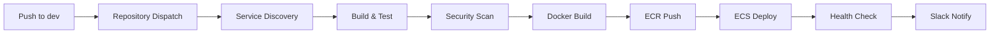

# Event Planner Platform - DevOps Infrastructure Documentation
## Part 4: Deployment Workflows and Automation

**Author:** DevOps Team  
**Last Updated:** October 30, 2025  
**Version:** 1.0.0

---

## Deployment Strategy Overview

The Event Planner Platform implements **environment-specific deployment strategies** optimized for different use cases:

- **Development**: Rolling deployment with auto-deploy
- **Staging**: Rolling deployment with manual approval
- **Production**: Blue-green deployment with comprehensive testing

---

## Development Environment Deployment

### Automatic Deployment Workflow

**Trigger**: Push to `dev` branch in application repositories



### Service Activation Process

The deployment pipeline includes **intelligent service management** that handles various ECS service states:

```yaml
# Check service status and activate if needed
SERVICE_STATUS=$(echo $SERVICE_INFO | jq -r '.Status')
DESIRED_COUNT=$(echo $SERVICE_INFO | jq -r '.DesiredCount')

if [ "$SERVICE_STATUS" = "INACTIVE" ] || [ "$DESIRED_COUNT" = "0" ]; then
  echo "🔄 Service $SERVICE_NAME is INACTIVE. Scaling up..."
  aws ecs update-service \
    --cluster "$CLUSTER_NAME" \
    --service "$SERVICE_NAME" \
    --desired-count 1
fi
```

**Service States Handled**:
- **NOT_FOUND**: Service doesn't exist (requires Terraform apply)
- **INACTIVE**: Service exists but scaled to 0 (auto-scale up)
- **ACTIVE**: Service running normally (proceed with deployment)

### Selective Service Deployment

**Innovation**: Only deploy services that have changed, reducing deployment time and costs.

```yaml
# Determine which services to deploy
ENABLED_SERVICES=("auth-service" "notification-service")
FILTERED_SERVICES=()

for service in $(echo $SERVICES | jq -r '.[]'); do
  if [[ " ${ENABLED_SERVICES[*]} " =~ " $service " ]]; then
    FILTERED_SERVICES+=("\"$service\"")
    echo "✅ $service is enabled for deployment"
  else
    echo "⚠️ $service is not enabled in Terraform (skipping)"
  fi
done
```

**Benefits**:
- **Faster deployments**: Only build/deploy changed services
- **Reduced costs**: Less compute time and data transfer
- **Lower risk**: Smaller blast radius for changes

---

## Production Deployment Strategy

### Blue-Green Deployment ⭐ IMPLEMENTED

**Purpose**: Zero-downtime deployments with instant rollback capability.

```yaml
# Production deployment uses blue-green strategy
backend-prod-blue-green:
  needs: [pipeline-start, infrastructure-pipeline]
  if: inputs.run_backend && inputs.environment == 'prod'
  strategy:
    matrix:
      service: [auth-service, notification-service]  # Currently active
  uses: ./.github/workflows/backend-prod-blue-green.yml

frontend-prod-blue-green:
  needs: [pipeline-start, infrastructure-pipeline]
  if: inputs.run_frontend && inputs.environment == 'prod'
  uses: ./.github/workflows/frontend-prod-blue-green.yml
```

### Blue-Green Architecture

**Frontend**:
```
CloudFront (Production) → Origin Switch
  ├── Blue S3 Bucket (current)
  ├── Green S3 Bucket (new version)
  └── Backup S3 Bucket (rollback)
```

**Backend**:
```
ALB → Weighted Target Groups
  ├── Blue Target Group → Blue ECS Services
  └── Green Target Group → Green ECS Services
```

### Blue-Green Process Flow

#### Frontend Deployment

1. **Security Scan** - npm audit (fails on critical/high)
2. **Build** - Production Angular build with unique ID
3. **Deploy Green** - Upload to green S3 bucket
4. **Smoke Tests** - Health check + performance (< 2s)
5. **Backup Blue** - Sync current blue to timestamped backup
6. **Switch Origin** - Update CloudFront to point to green
7. **Validate** - Production health checks + CloudWatch metrics
8. **Promote** - Sync green to blue (or rollback on failure)

**Duration**: 15-30 minutes

#### Backend Deployment

1. **Security & Build** - Trivy scan + Maven build + 70% coverage
2. **Deploy Green Services** - Create/update green ECS services (2 tasks)
3. **Health Checks** - Actuator endpoints (20 retries, 15s interval)
4. **Canary Test** - 10% traffic to green for 5 minutes
5. **Progressive Shift** - 50% (2 min) → 100% traffic to green
6. **Validate** - CloudWatch alarms + 3-minute monitoring
7. **Promote** - Update blue with green task def (or rollback)

**Duration**: 35-60 minutes

### Infrastructure Requirements

#### Frontend Blue-Green Setup

**Required Resources**:
```bash
# S3 Buckets
event-planner-prod-frontend        # Blue (current)
event-planner-prod-frontend-green  # Green (new)
event-planner-prod-frontend-backup # Backup

# CloudFront Distributions
Production Distribution (E1234...)  # Switches between blue/green
Green Distribution (E5678...)       # For testing green

# DNS Records (External)
events.sankofagrid.com              # Production
green.events.sankofagrid.com        # Green testing
```

**Cost Impact**: +$6/month (S3 storage + CloudFront)

#### Backend Blue-Green Setup

**Required Resources**:
```hcl
# ECS Services (per microservice)
resource "aws_ecs_service" "blue" {
  name = "auth-service"
  desired_count = 2
}

resource "aws_ecs_service" "green" {
  name = "auth-service-green"
  desired_count = 0  # Scaled to 0 when not deploying
}

# Target Groups
resource "aws_lb_target_group" "blue" {
  name = "event-planner-prod-auth-blue-tg"
}

resource "aws_lb_target_group" "green" {
  name = "event-planner-prod-auth-green-tg"
}

# Weighted ALB Listener
resource "aws_lb_listener_rule" "weighted" {
  action {
    type = "forward"
    forward {
      target_group {
        arn = aws_lb_target_group.blue.arn
        weight = 100  # Initially all to blue
      }
      target_group {
        arn = aws_lb_target_group.green.arn
        weight = 0    # No traffic to green
      }
    }
  }
}
```

**Cost Impact**: $0 (green scaled to 0), ~$1/hour during deployment

### Challenges & Mitigations

#### 1. Shared Database Challenge

**Issue**: Both blue and green connect to same PostgreSQL instance

**Mitigation**:
```sql
-- Use backward-compatible migrations
-- Phase 1: Add new columns (nullable)
ALTER TABLE users ADD COLUMN new_field VARCHAR(255);

-- Phase 2: Deploy green services
-- Phase 3: Backfill data
UPDATE users SET new_field = old_field WHERE new_field IS NULL;

-- Phase 4: Switch traffic
-- Phase 5: Remove old columns (next deployment)
ALTER TABLE users DROP COLUMN old_field;
```

#### 2. Shared Redis Cache

**Issue**: Blue and green share same ElastiCache

**Mitigation**:
```java
// Use key prefixes
String cacheKey = environment + ":session:" + userId;
// blue:session:123 vs green:session:123
```

#### 3. SQS/SNS Message Routing

**Issue**: Both environments consume from same queues

**Mitigation**: Accept shared queues (messages are idempotent)

#### 4. External DNS Manual Updates

**Issue**: Cannot automate DNS (not Route53)

**Mitigation**:
- Pre-create `green.events.sankofagrid.com`
- Keep pointing to green CloudFront permanently
- Only switch production CloudFront origin (automated)

#### 5. Single-AZ Limitation (Dev)

**Issue**: Dev uses single-AZ for cost optimization

**Mitigation**:
- Keep single-AZ for dev/staging
- Use multi-AZ for production
- Both blue and green run in same AZ during deployment

### Deployment Security

**Security Gates**:
- ✅ Trivy scan blocks on CRITICAL/HIGH vulnerabilities
- ✅ npm audit blocks on critical/high vulnerabilities
- ✅ Code coverage minimum 70%
- ✅ All secrets from AWS Secrets Manager
- ✅ Encrypted in transit (HTTPS/TLS)
- ✅ Private subnets for all services

### Monitoring During Deployment

**CloudWatch Metrics**:
```yaml
# Monitor during canary phase
- HTTPCode_Target_5XX_Count
- TargetResponseTime
- HealthyHostCount
- UnHealthyHostCount
```

**Automatic Rollback Triggers**:
- Health check failures
- High error rates (> 10 errors in 5 min)
- CloudWatch alarm state = ALARM
- Response time > 2s (frontend)
- Integration test failures

---

## Infrastructure Deployment Workflow

### Terraform Deployment Process

**Manual Trigger**: Infrastructure changes require explicit approval.

```yaml
# Infrastructure pipeline with manual approval
infrastructure-pipeline:
  needs: pipeline-start
  if: inputs.run_infrastructure
  uses: ./.github/workflows/infrastructure-ci-cd.yml
  with:
    environment: ${{ inputs.environment }}
    action: apply
  secrets: inherit
```

### Infrastructure Change Management

1. **Plan Phase**: Generate and review Terraform plan
2. **Approval Phase**: Manual approval for staging/production
3. **Apply Phase**: Execute infrastructure changes
4. **Validation Phase**: Verify infrastructure health

### Service Enablement Process

To activate additional services (event, booking, payment):

#### Step 1: Update Terraform Configuration

```bash
# Uncomment service blocks in ECS module
vim terraform/modules/ecs/main.tf

# Uncomment database blocks in RDS module  
vim terraform/modules/rds/main.tf
```

#### Step 2: Apply Infrastructure Changes

```bash
cd terraform/environments/dev
terraform plan -out=tfplan
terraform apply tfplan
```

#### Step 3: Update CI/CD Pipeline

```bash
# Update enabled services list
vim .github/workflows/backend-ci-cd.yml

# Change from:
ENABLED_SERVICES=("auth-service" "notification-service")

# To:
ENABLED_SERVICES=("auth-service" "notification-service" "event-service")
```

#### Step 4: Deploy Application Code

```bash
# Trigger deployment with new service
gh workflow run backend-ci-cd.yml \
  --ref dev \
  -f environment=dev \
  -f services='["auth-service", "notification-service", "event-service"]'
```

---

## Deployment Automation Features

### 1. Health Check Integration

**ECS Health Checks**: Container-level health monitoring

```yaml
healthCheck = {
  command = [
    "CMD-SHELL", 
    "curl -f http://localhost:${each.value.port}/actuator/health || exit 1"
  ]
  interval = 30
  timeout = 5
  retries = 3
  startPeriod = 90
}
```

**ALB Health Checks**: Load balancer health monitoring

```yaml
health_check_healthy_threshold = 2
health_check_unhealthy_threshold = 3
health_check_timeout = 5
health_check_interval = 30
health_check_path = "/actuator/health"
```

### 2. Deployment Circuit Breaker

```yaml
deployment_circuit_breaker {
  enable = true
  rollback = true
}
```

**Benefits**:
- **Automatic rollback** on deployment failures
- **Prevents cascading failures** across services
- **Maintains service availability** during problematic deployments

### 3. Graceful Service Updates

```yaml
# Deployment configuration for zero-downtime updates
deployment_maximum_percent = 200          # Allow 2x capacity during deployment
deployment_minimum_healthy_percent = 100  # Maintain full capacity
health_check_grace_period_seconds = 300   # Allow Spring Boot startup time
```

---

## Rollback Strategies

### Automatic Rollback (Commented Out)

The pipeline includes rollback capability (currently disabled for simplicity):

```yaml
# rollback-on-failure:
#   needs: [prepare, deploy-to-ecs]
#   if: failure()
#   steps:
#     - name: Rollback Deployment
#       run: |
#         # Get the previous stable task definition
#         PREVIOUS_TASK_DEF=$(aws ecs describe-services \
#           --cluster "$CLUSTER_NAME" \
#           --services "$SERVICE_NAME" \
#           --query 'services[0].deployments[?status==`PRIMARY`].taskDefinition')
#         
#         # Update service to use previous task definition
#         aws ecs update-service \
#           --cluster "$CLUSTER_NAME" \
#           --service "$SERVICE_NAME" \
#           --task-definition "$PREVIOUS_TASK_DEF"
```

### Manual Rollback Process

1. **Identify last known good deployment**
2. **Retrieve previous task definition ARN**
3. **Update ECS service** to use previous task definition
4. **Monitor service stability**
5. **Verify application functionality**

---

## Environment Promotion Workflow

### Development → Staging

```bash
# 1. Merge dev to staging branch
git checkout staging
git merge dev

# 2. Trigger staging deployment
gh workflow run master-pipeline.yml \
  --ref staging \
  -f environment=staging \
  -f run_backend=true \
  -f run_frontend=true
```

### Staging → Production

```bash
# 1. Create production release
git checkout main
git merge staging
git tag -a v1.0.0 -m "Production release v1.0.0"

# 2. Trigger production deployment (manual approval required)
gh workflow run master-pipeline.yml \
  --ref main \
  -f environment=prod \
  -f run_backend=true \
  -f run_frontend=true
```

---

## Deployment Monitoring

### Real-Time Deployment Tracking

```yaml
- name: Wait for Service Stability
  run: |
    echo "⏳ Waiting for service to stabilize (timeout: 10 minutes)..."
    
    if timeout 600 aws ecs wait services-stable \
      --cluster "$CLUSTER_NAME" \
      --services "$SERVICE_NAME"; then
      echo "✅ Service $SERVICE_NAME is stable"
    else
      echo "❌ Service failed to stabilize within 10 minutes"
      # Detailed failure analysis
      aws ecs describe-services --cluster "$CLUSTER_NAME" --services "$SERVICE_NAME"
      exit 1
    fi
```

### Deployment Metrics Collection

- **Deployment duration**: Track time from start to completion
- **Success rate**: Monitor deployment success/failure rates
- **Service health**: Track service stability post-deployment
- **Resource utilization**: Monitor CPU/memory during deployments

### Failure Analysis

```yaml
echo "🔍 Task failures (if any):"
TASK_ARNS=$(aws ecs list-tasks \
  --cluster "$CLUSTER_NAME" \
  --service-name "$SERVICE_NAME" \
  --query 'taskArns' \
  --output text)

if [ -n "$TASK_ARNS" ]; then
  aws ecs describe-tasks \
    --cluster "$CLUSTER_NAME" \
    --tasks $TASK_ARNS \
    --query 'tasks[*].{TaskArn:taskArn,LastStatus:lastStatus,StoppedReason:stoppedReason}'
fi
```

---

## Deployment Security

### 1. Secrets Management During Deployment

```yaml
# Secrets retrieved at runtime from AWS Secrets Manager
secrets = [
  {
    name = "DB_PASSWORD"
    valueFrom = "${var.db_secret_arns[each.key]}:password::"
  },
  {
    name = "JWT_SECRET"
    valueFrom = "${var.jwt_secret_arn}:JWT_SECRET::"
  }
]
```

### 2. Image Security Scanning

```yaml
- name: Security Scan (Trivy)
  uses: aquasecurity/trivy-action@master
  with:
    scan-type: 'fs'
    scan-ref: 'services/${{ matrix.service }}'
    format: 'sarif'
    output: 'trivy-results.sarif'
```

### 3. Network Security During Deployment

- **Private subnets**: All deployments occur in private subnets
- **Security groups**: Strict ingress/egress rules
- **VPC endpoints**: Secure communication with AWS services
- **Encryption in transit**: All data encrypted during deployment

---

## Deployment Best Practices

### 1. Immutable Deployments

- **Container images** are immutable and tagged with commit SHA
- **Infrastructure** changes are version controlled
- **Configuration** is externalized via environment variables and secrets

### 2. Progressive Deployment

- **Single service** deployments to reduce blast radius
- **Health checks** at multiple levels (container, service, load balancer)
- **Monitoring** throughout deployment process

### 3. Deployment Validation

```yaml
# Post-deployment validation
- name: Validate Deployment
  run: |
    # Wait for service to be healthy
    sleep 30
    
    # Test service endpoint
    curl -f "https://api.sankofagrid.com/actuator/health" || exit 1
    
    # Verify service registration in Cloud Map
    aws servicediscovery list-instances \
      --service-id "$SERVICE_DISCOVERY_ID" \
      --query 'Instances[?HealthStatus==`HEALTHY`]'
```

---

## Blue-Green Deployment Best Practices

### Pre-Deployment Checklist

- [ ] All tests passing in staging
- [ ] Security scans completed
- [ ] Database migrations backward-compatible
- [ ] Rollback plan documented
- [ ] Team notified of deployment window
- [ ] Monitoring dashboards ready
- [ ] Green infrastructure provisioned

### During Deployment

- [ ] Monitor deployment progress
- [ ] Watch CloudWatch metrics
- [ ] Check application logs
- [ ] Verify health endpoints
- [ ] Test critical user flows
- [ ] Monitor canary metrics (backend)

### Post-Deployment

- [ ] Verify all services healthy
- [ ] Check error rates normalized
- [ ] Monitor for 24 hours
- [ ] Document any issues
- [ ] Update runbooks if needed
- [ ] Scale down green environment

### Rollback Procedures

**Automatic Rollback** (built-in):
- Triggers on any health check failure
- Triggers on high error rates
- Triggers on CloudWatch alarms
- Immediate traffic switch back to blue

**Manual Rollback**:

```bash
# Frontend rollback
DISTRIBUTION_ID="E1234567890ABC"
BLUE_BUCKET="event-planner-prod-frontend"

CONFIG=$(aws cloudfront get-distribution-config --id $DISTRIBUTION_ID)
ETAG=$(echo $CONFIG | jq -r '.ETag')

echo $CONFIG | jq --arg bucket "$BLUE_BUCKET.s3.amazonaws.com" \
  '.DistributionConfig.Origins.Items[0].DomainName = $bucket' | \
  jq '.DistributionConfig' > config.json

aws cloudfront update-distribution \
  --id $DISTRIBUTION_ID \
  --distribution-config file://config.json \
  --if-match $ETAG

# Backend rollback
aws elbv2 modify-listener \
  --listener-arn $ALB_LISTENER_ARN \
  --default-actions Type=forward,TargetGroupArn=$BLUE_TARGET_GROUP

for service in auth-service notification-service; do
  aws ecs update-service \
    --cluster event-planner-prod-cluster \
    --service ${service}-green \
    --desired-count 0
done
```

---

## Future Enhancements

### Completed ✅

1. **Blue-Green Deployment**: Zero-downtime production deployments
2. **Canary Testing**: Gradual traffic shifting with monitoring
3. **Automated Rollback**: Automatic rollback on failures

### Planned Improvements

1. **Feature Flags**: Runtime feature toggling without deployments
2. **Automated E2E Testing**: End-to-end test automation in pipeline
3. **Performance Testing**: Load testing during canary phase
4. **Multi-Region Deployments**: Cross-region deployment orchestration
5. **Database Blue-Green**: Separate database instances for blue/green

---

## Next Steps

This covers deployment workflows and automation. Continue with:

- **Part 5**: Monitoring, Security, and Operations
- **Part 6**: Cost Optimization and Best Practices
- **Part 7**: Troubleshooting and Runbooks