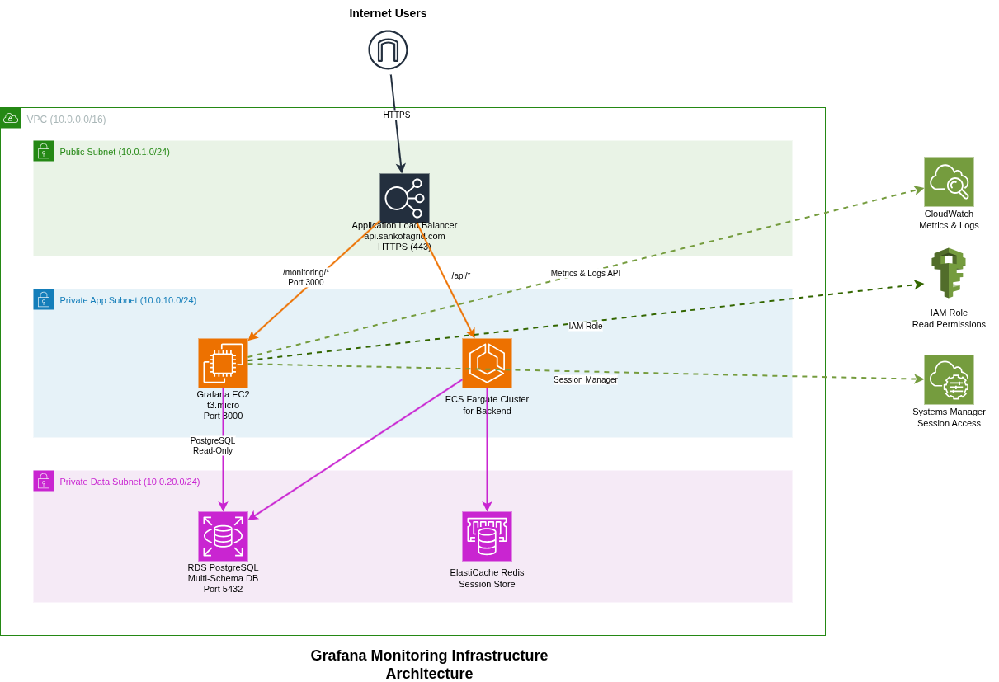

# Grafana Monitoring Documentation

**Last Updated:** November 2025  
**Version:** 2.0.0  
**Access URL:** https://api.sankofagrid.com/monitoring/

## Table of Contents

1. [Overview](#overview)
2. [Architecture](#architecture)
3. [Infrastructure](#infrastructure)
4. [Deployment](#deployment)
5. [Configuration](#configuration)
6. [Dashboards](#dashboards)
7. [Alerting](#alerting)
8. [User Management](#user-management)
9. [Maintenance](#maintenance)
10. [Troubleshooting](#troubleshooting)

## Overview

Grafana provides centralized monitoring dashboards accessible to all teams without AWS console access. It integrates with CloudWatch for infrastructure metrics and PostgreSQL for application data.

**Key Features:**
- Path-based routing via ALB (`/monitoring/*`)
- CloudWatch and PostgreSQL data sources
- Role-based access control
- Real-time alerting

**Access:**
- Username: `admin`
- Password: Provided separately
- Change password after first login

## Architecture



**Architecture Diagram:** See `docs/diagrams/grafana-architecture.png` for detailed component visualization.

**Data Flow:**

```
                    ┌─────────────┐
                    │    Users    │
                    └──────┬──────┘
                           │ HTTPS
                           ▼
            ┌──────────────────────────────┐
            │  Application Load Balancer   │
            │   (api.sankofagrid.com)      │
            └──────────────┬───────────────┘
                           │ /monitoring/*
                           ▼
                  ┌─────────────────┐
                  │  Grafana EC2    │
                  │ (Private Subnet)│
                  └────────┬────────┘
                           │
              ┌────────────┴────────────┐
              │                         │
              ▼                         ▼
      ┌──────────────┐          ┌──────────────┐
      │  CloudWatch  │          │  PostgreSQL  │
      │  (Metrics)   │          │  (App Data)  │
      └──────────────┘          └──────────────┘
```

**Key Components:**
- ALB listener rule (Priority 1) routes `/monitoring/*` to Grafana
- EC2 instance in private subnet hosts Grafana
- IAM role provides CloudWatch read access
- Security groups control network access
- PostgreSQL read-only user for application data

## Infrastructure

### EC2 Instance
- Type: t3.micro (2 vCPU, 1GB RAM)
- OS: Amazon Linux 2023
- Storage: 30GB gp3 EBS (encrypted)
- Location: Private application subnet
- Access: SSM Session Manager only

### Security Groups

**Grafana SG:**
- Inbound: Port 3000 from ALB SG
- Outbound: Port 443 (CloudWatch), Port 5432 (RDS)

**RDS SG Update:**
- Add: Port 5432 from Grafana SG

### ALB Configuration

**Target Group:** `grafana-monitoring-tg`
- Protocol: HTTP, Port: 3000
- Health check: `/api/health` (30s interval)

**Listener Rule:**
- Path: `/monitoring/*`
- Priority: 1 (highest)
- Action: Forward to target group

### IAM Role

Permissions: CloudWatch metrics/logs read, EC2 describe, tag resources

### Monitoring

CloudWatch alarms for:
- Grafana CPU > 80%
- Unhealthy targets

## Deployment

### Prerequisites
- AWS CLI configured
- Terraform >= 1.5.0
- RDS master credentials

### Steps

1. Set admin password:
```bash
export TF_VAR_grafana_admin_password="YourStrongPassword123!"
```

2. Deploy:
```bash
cd terraform/environments/dev
terraform init
terraform apply
```

3. Verify:
```bash
terraform output grafana_url
```

4. Access: https://api.sankofagrid.com/monitoring/

### Post-Deployment

**Day 1:**
- Change admin password
- Configure CloudWatch data source
- Create database read-only user
- Configure PostgreSQL data source

**Week 1:**
- Create dashboards (Executive, Infrastructure, Performance)
- Set up email notifications
- Configure critical alerts

**Week 2:**
- Create user accounts
- Assign roles
- Train teams

## Configuration

### Data Sources

#### CloudWatch

1. Configuration → Data Sources → Add data source → CloudWatch
2. Settings:
   - Name: AWS CloudWatch
   - Auth: AWS SDK Default
   - Region: eu-west-1
   - Namespaces: ECS, RDS, ElastiCache, ALB, SQS, SNS
3. Save & Test

#### PostgreSQL

**Create read-only user:**
```sql
CREATE USER grafana_reader WITH PASSWORD '<password>';
GRANT CONNECT ON DATABASE eventplannerdb TO grafana_reader;
GRANT USAGE ON SCHEMA auth_schema, event_schema, payment_schema, audit_schema TO grafana_reader;
GRANT SELECT ON ALL TABLES IN SCHEMA auth_schema, event_schema, payment_schema, audit_schema TO grafana_reader;
ALTER DEFAULT PRIVILEGES IN SCHEMA auth_schema, event_schema, payment_schema, audit_schema 
  GRANT SELECT ON TABLES TO grafana_reader;
```

**Add data source:**
1. Configuration → Data Sources → Add data source → PostgreSQL
2. Settings:
   - Name: EventPlanner Database
   - Host: `<rds-endpoint>:5432`
   - Database: eventplannerdb
   - User: grafana_reader
   - SSL Mode: require
3. Save & Test

## Dashboards

### Executive Dashboard

**Purpose:** Business metrics for stakeholders

**Metrics:**
- Total events (today, week, month)
- Total payments and revenue
- Active users
- Payment success rate

**Sample Query:**
```sql
SELECT COUNT(*) FROM event_schema.events WHERE DATE(created_at) = CURRENT_DATE;
```

### Infrastructure Dashboard

**Purpose:** System health monitoring

**Metrics:**
- ECS: CPU/Memory utilization, task count
- RDS: CPU, connections, IOPS
- ElastiCache: CPU, cache hit rate, evictions

**Thresholds:**
- ECS CPU: Warning 70%, Critical 80%
- RDS CPU: Warning 60%, Critical 75%
- Cache Hit Rate: Warning < 80%

### Performance Dashboard

**Purpose:** Application performance

**Metrics:**
- ALB request count and response times (p50, p95, p99)
- HTTP 4xx/5xx errors
- API latency by service

**Targets:**
- p50: < 200ms, p95: < 500ms, p99: < 1000ms
- Error rate: < 0.1%

### Security Dashboard

**Purpose:** Security monitoring

**Metrics:**
- Failed authentication attempts
- Suspicious activity patterns
- Audit log anomalies

**Sample Query:**
```sql
SELECT audit_log_data_json->>'service' as service, COUNT(*) as count
FROM audit_schema.audit_log_jsonb
WHERE created_at > NOW() - INTERVAL '24 hours'
GROUP BY service;
```

## Alerting

### Notification Channels

**Email:**
- Settings → Alerting → Contact points
- Add team email addresses

**Slack (Optional):**
- Create webhook
- Add Slack contact point

### Alert Rules

**Critical:**
- Service Down: Healthy targets = 0 for 2 min
- High Error Rate: 5xx > 10/min for 5 min
- Database CPU: > 80% for 10 min

**Warning:**
- High CPU: ECS > 70% for 10 min
- Low Cache Hit: < 80% for 15 min
- Slow Response: p95 > 500ms for 10 min

## User Management

### Roles

- **Admin:** Full access (Engineering leads)
- **Editor:** Create/edit dashboards (DevOps, SRE)
- **Viewer:** View only (Product, Business)

### Creating Users

1. Configuration → Users → Invite
2. Enter email, name, username
3. Assign role
4. Send credentials securely

## Maintenance

### Backup

**Script:** `/home/ec2-user/backup-grafana.sh`
```bash
#!/bin/bash
BACKUP_DIR="/home/ec2-user/grafana-backups"
DATE=$(date +%Y%m%d_%H%M%S)
mkdir -p $BACKUP_DIR
sudo cp /var/lib/grafana/grafana.db $BACKUP_DIR/grafana_$DATE.db
find $BACKUP_DIR -name "grafana_*.db" -mtime +7 -delete
```

**Cron:** `0 2 * * * /home/ec2-user/backup-grafana.sh`

### Updates

```bash
sudo yum update grafana -y
sudo systemctl restart grafana-server
curl http://localhost:3000/api/health
```

### Logs

- Grafana: `/var/log/grafana/grafana.log`
- System: `sudo journalctl -u grafana-server -f`

## Troubleshooting

### Cannot Access Grafana

Check target health:
```bash
aws elbv2 describe-target-health --target-group-arn <arn>
```

Check service:
```bash
aws ssm start-session --target <instance-id>
sudo systemctl status grafana-server
```

### CloudWatch Data Missing

Verify IAM permissions and test API:
```bash
aws cloudwatch list-metrics --namespace AWS/ECS
```

### Database Connection Failed

Test connectivity:
```bash
psql -h <rds-endpoint> -U grafana_reader -d eventplannerdb
```

Verify security groups allow traffic.

### High CPU

Solutions:
- Reduce dashboard refresh rates
- Optimize queries
- Upgrade to t3.medium

## Cost Analysis

**Monthly Cost:**
- EC2 t3.micro: $15
- EBS 30GB: $2
- Data transfer: $1
- **Total: $18/month**

**No additional ALB cost** (reusing existing)

## Security Checklist

- Strong admin password
- IAM least privilege
- Security groups configured
- RDS read-only user
- SSL/TLS via ALB
- User sign-up disabled
- Anonymous access disabled
- Regular backups
- SSM access only

## Support

**Slack:**
- #incidents: Critical issues
- #devops-alerts: Infrastructure
- #monitoring: Dashboard questions

**Email:** devops-team@event-planner.internal

## Resources

- [Grafana Documentation](https://grafana.com/docs/grafana/latest/)
- [CloudWatch Data Source](https://grafana.com/docs/grafana/latest/datasources/cloudwatch/)
- [PostgreSQL Data Source](https://grafana.com/docs/grafana/latest/datasources/postgres/)
